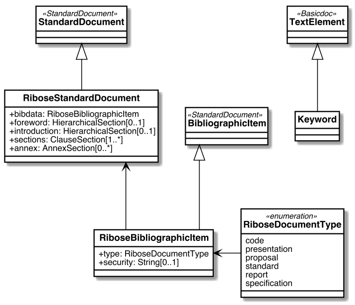

= Metanorma RSD Models

image:https://github.com/metanorma/metanorma-model-rsd/workflows/make/badge.svg["Build Status", link="https://github.com/metanorma/metanorma-model-rsd/actions?query=workflow%3Amake"]

This is where we keep the Metanorma RSD model definitions.

The RSD Standard Document format is an instance of the
https://github.com/metanorma/metanorma-model-iso[Metanorma IsoDoc model].
Details of the general model can be found on its page.

== RSD Standard Document Model

