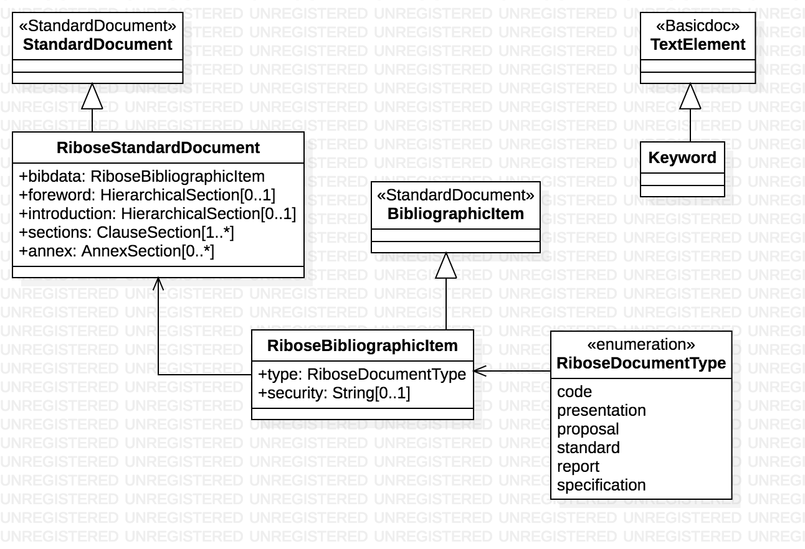

= Metanorma RSD Models

This is where we keep the Metanorma RSD model definitions.

The RSD Standard Document format is an instance of the
https://github.com/riboseinc/isodoc-models[Metanorma IsoDoc model].
Details of the general model can be found on its page.

== RSD Standard Document Model

